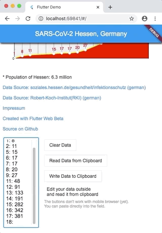

# nhochx

Show x-y-chart using Flutter Web and mp_chart

## Getting Started

Prepare for local run and build:
```
flutter channel master
flutter upgrade
flutter config --enable-web
```

The initial data values are read from `assets/data_values.txt`.

Values are formatted like this:
```
0: 1
1: 8
2: 11
5: 15
```

Run in Chrome:
`flutter run -d Chrome`


Build for deployment:
`flutter build web`

Deploy to web server: copy contents of folder build/web:

```
$ ls -l
total 5224
drwxr-xr-x  7 alfred  staff      224 17 Mär 13:07 assets
-rw-r--r--  1 alfred  staff      917 17 Mär 11:09 favicon.png
-rw-r--r--  1 alfred  staff     1344 17 Mär 13:23 flutter_service_worker.js
drwxr-xr-x  4 alfred  staff      128 17 Mär 13:07 icons
-rw-r--r--  1 alfred  staff     1118 17 Mär 11:09 index.html
-rw-r--r--  1 alfred  staff  1381425 17 Mär 13:23 main.dart.js
-rw-r--r--  1 alfred  staff  1273075 17 Mär 13:23 main.dart.js.map
-rw-r--r--  1 alfred  staff      568 17 Mär 11:09 manifest.json
```

